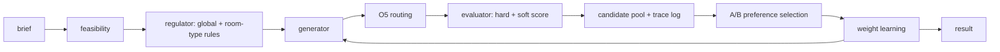

# FloorPlanner Layout Engine Architecture

## Core Thesis

The layout engine is deterministic and domain-agnostic. It places units inside a space while respecting hard constraints and optimizing soft constraints. Rules are data, represented as envelopes, not hardcoded geometry behavior.

AI is used only for:

- rule induction from structured references
- explanation of decisions and tradeoffs

Geometry, feasibility, generation, evaluation, routing, and preference convergence remain classic deterministic software.

## MVP Pipeline



## Knowledge Model

Rules are envelopes:

```ts
interface Envelope {
  core: number;
  halo: number;
  sat: number;
  conf: number;
  scope: "global" | "room-type";
}
```

- `core`: hard minimum
- `halo`: soft desirable range
- `sat`: saturation point where more distance no longer helps
- `conf`: confidence derived from reference variance
- `scope`: global prior or room-type-specific rule

## Module Target

```text
src/
  elements/
    model.ts
    library.ts
  rules/
    envelope.ts
    ruleset.ts
    induction.ts
  engine/
    generator.ts
    evaluator.ts
    routing.ts
    feasibility.ts
    preference.ts
  constraints/
    brief.ts
    zones.ts
  components/
    InspectorO1.tsx
    ConfiguratorO2.tsx
    Plan2D.tsx
    Iso3D.tsx
    LearningAB.tsx
    Trace.tsx
  ifc/
  App.tsx
```

## Guardrails

- Hard constraints are never violated.
- Soft constraints may bend only through explicit penalties.
- Door swing is a hard rule.
- Orientation is derived from wall-routed connection points.
- User-supplied properties override defaults and IFC-derived properties.
- The same constraint interface serves user-entered constraints and future nested room layout constraints.
- Every accepted and rejected candidate must be explainable through trace data.
